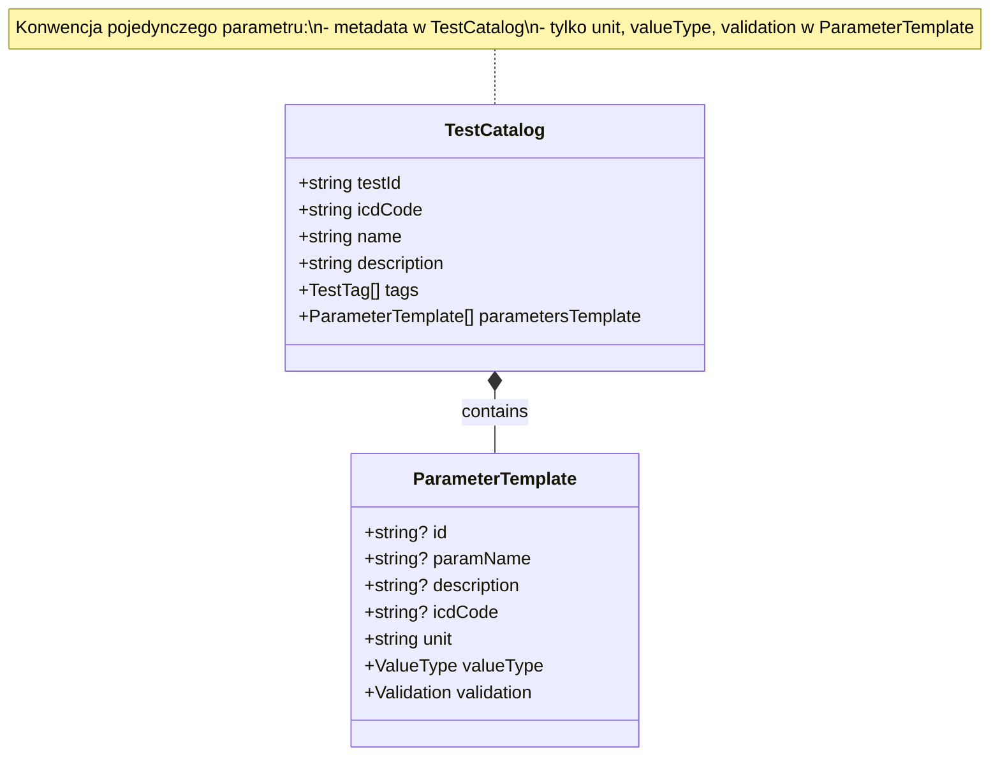

# Dokumentacja Domeny

Poniżej opisane zostały ustalenia dotyczące modelu domenowego dla `TestCatalog` i `ParameterTemplate` wraz z konwencją pojedynczego parametru.

## TestCatalog

- **testId**: unikalny identyfikator testu (6–10 znaków)
- **icdCode**: kod ICD-9/10 dla całego badania
- **name**: nazwa badania
- **description**: szczegółowy opis badania (~200 znaków)
- **tags**: lista tagów zdefiniowanych przez `TestTag[]`
- **parametersTemplate**: tablica obiektów `ParameterTemplate`

## Konwencja pojedynczego parametru

Jeśli `parametersTemplate` zawiera dokładnie jeden element:
- Metadane (`id`, `paramName`, `description`, `icdCode`) przechowywane są w `TestCatalog`.
- W obiekcie `ParameterTemplate` definiujemy tylko:
  - `unit` (jednostka miary)
  - `valueType` (`number`, `string`, `boolean`)
  - `validation` (zakres referencyjny lub `allowedValues`)

## ParameterTemplate

- **id?**: opcjonalne, używane gdy test ma wiele parametrów
- **paramName?**: opcjonalne, nazwa parametru (jeśli multi)
- **description?**: opcjonalne, opis parametru (jeśli multi)
- **icdCode?**: opcjonalne, kod ICD dla parametru (jeśli multi)
- **unit**: jednostka miary
- **valueType**: `'number' | 'string' | 'boolean'`
- **validation?**:
  - `min?`: minimalna wartość
  - `max?`: maksymalna wartość
  - `allowedValues?`: lista wartości dopuszczalnych (dla typów jakościowych)

## Diagram klas

