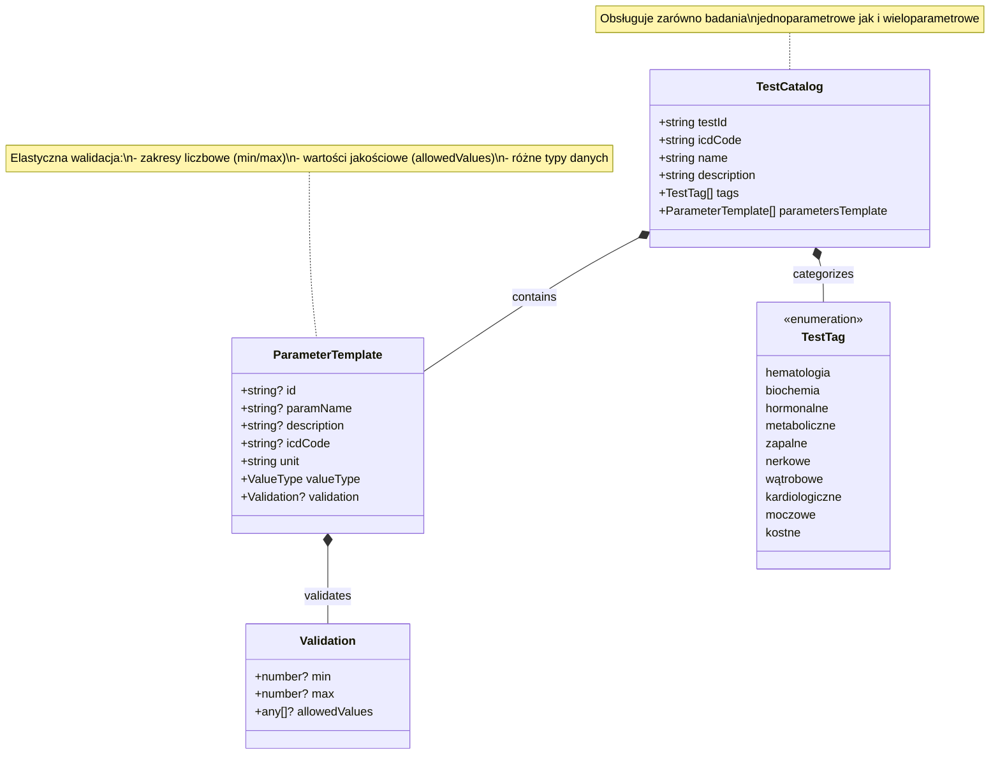

# Dokumentacja Modelu Domenowego - Katalog Badań Laboratoryjnych

Poniżej opisane zostały ustalenia dotyczące modelu domenowego dla `TestCatalog` i `ParameterTemplate` służącego do reprezentacji dowolnych badań laboratoryjnych w systemie MyHealth.

## Architektura modelu

### TestCatalog

Główna encja reprezentująca badanie laboratoryjne:

- **testId**: unikalny identyfikator testu (6–10 znaków)
- **icdCode**: kod ICD-9/10 dla całego badania
- **name**: nazwa badania
- **description**: szczegółowy opis badania (~200 znaków)
- **tags**: lista tagów kategoryzujących badanie (`TestTag[]`)
- **parametersTemplate**: tablica szablonów parametrów (`ParameterTemplate[]`)

### ParameterTemplate

Szablon definiujący parametr badania:

- **id**: identyfikator parametru (wymagany dla badań wieloparametrowych)
- **paramName**: nazwa parametru (wymagany dla badań wieloparametrowych)
- **description**: opis parametru (wymagany dla badań wieloparametrowych)
- **icdCode**: kod ICD dla parametru (opcjonalny)
- **unit**: jednostka miary (np. "mg/dL", "g/L", "/HPF")
- **valueType**: typ wartości (`'number' | 'string' | 'boolean'`)
- **validation**: reguły walidacji (opcjonalne)
  - `min` / `max`: zakres dla wartości liczbowych
  - `allowedValues`: lista dopuszczalnych wartości dla typów jakościowych

## Konwencje projektowe

### Badania jednoparametrowe

Jeśli `parametersTemplate` zawiera dokładnie **jeden element**:
- Metadane (`id`, `paramName`, `description`, `icdCode`) przechowywane są w `TestCatalog`
- W obiekcie `ParameterTemplate` definiujemy tylko:
  - `unit` (jednostka miary)
  - `valueType` (typ wartości)
  - `validation` (reguły walidacji)

**Przykład - Glukoza na czczo:**
```json
{
  "testId": "glukoza",
  "icdCode": "L43",
  "name": "Glukoza na czczo",
  "description": "Badanie poziomu glukozy we krwi po 8-12h postu",
  "tags": ["biochemia", "metaboliczne"],
  "parametersTemplate": [
    {
      "unit": "mg/dL",
      "valueType": "number",
      "validation": { "min": 70, "max": 99 }
    }
  ]
}
```

### Badania wieloparametrowe

Dla badań zawierających **wiele parametrów**:
- Każdy `ParameterTemplate` zawiera pełne metadane
- Umożliwia opisanie złożonych analiz laboratoryjnych
- Każdy parametr może mieć inny typ wartości i walidację

## Typy wartości i walidacji

### Wartości liczbowe (`valueType: "number"`)
Używane dla parametrów mierzalnych:
- **Zakres referencyjny**: `{"min": x, "max": y}`
- **Jednostki**: mg/dL, g/L, mU/L, /HPF, itp.
- **Przykłady**: stężenia substancji, liczba komórek, wskaźniki

### Wartości jakościowe (`valueType: "string"`)
Używane dla parametrów opisowych lub semi-ilościowych:
- **Dozwolone wartości**: `{"allowedValues": ["opcja1", "opcja2", ...]}`
- **Przykłady**: obecność/nieobecność, stopnie nasilenia (1+, 2+, 3+), opisy

### Wartości logiczne (`valueType: "boolean"`)
Używane dla parametrów binarnych:
- **Wartości**: `true` / `false`
- **Przykłady**: obecność/brak, pozytywny/negatywny

## Kategoryzacja badań

### TestTag - dostępne kategorie:
- `'hematologia'` - badania krwi i układu krwiotwórczego
- `'biochemia'` - badania biochemiczne krwi i moczu
- `'hormonalne'` - badania hormonów i układu endokrynnego
- `'metaboliczne'` - badania metabolizmu (glukoza, lipidy)
- `'zapalne'` - markery stanu zapalnego
- `'nerkowe'` - badania funkcji nerek
- `'wątrobowe'` - badania funkcji wątroby
- `'kardiologiczne'` - markery sercowo-naczyniowe
- `'moczowe'` - badania układu moczowego
- `'kostne'` - markery metabolizmu kostnego

## Przykłady różnych typów badań

### Przykład 1: Badanie jednoparametrowe (Hemoglobina)
```json
{
  "testId": "hgb",
  "icdCode": "L40",
  "name": "Hemoglobina",
  "description": "Oznaczenie stężenia hemoglobiny we krwi",
  "tags": ["hematologia"],
  "parametersTemplate": [
    {
      "unit": "g/dL",
      "valueType": "number",
      "validation": { "min": 12.0, "max": 17.5 }
    }
  ]
}
```

### Przykład 2: Badanie wieloparametrowe (Lipidogram)
```json
{
  "testId": "lipidogram",
  "icdCode": "L45",
  "name": "Lipidogram",
  "description": "Profil lipidowy - cholesterol, LDL, HDL, triglicerydy",
  "tags": ["biochemia", "metaboliczne"],
  "parametersTemplate": [
    {
      "id": "chol_cal",
      "paramName": "Cholesterol całkowity",
      "description": "Całkowite stężenie cholesterolu",
      "unit": "mg/dL",
      "valueType": "number",
      "validation": { "min": 0, "max": 200 }
    },
    {
      "id": "ldl",
      "paramName": "LDL",
      "description": "Cholesterol LDL (zły cholesterol)",
      "unit": "mg/dL",
      "valueType": "number",
      "validation": { "min": 0, "max": 100 }
    },
    {
      "id": "hdl",
      "paramName": "HDL",
      "description": "Cholesterol HDL (dobry cholesterol)",
      "unit": "mg/dL",
      "valueType": "number",
      "validation": { "min": 40, "max": 200 }
    }
  ]
}
```

### Przykład 3: Badanie jakościowe (Test ciążowy)
```json
{
  "testId": "hcg_test",
  "icdCode": "L50",
  "name": "Test ciążowy (hCG)",
  "description": "Jakościowy test na obecność hormonu hCG",
  "tags": ["hormonalne"],
  "parametersTemplate": [
    {
      "unit": "",
      "valueType": "string",
      "validation": { 
        "allowedValues": ["negatywny", "pozytywny", "wątpliwy"] 
      }
    }
  ]
}
```

### Przykład 4: Badanie ogólne moczu (wieloparametrowe, mieszane typy)
```json
{
  "testId": "badmocz",
  "icdCode": "A01",
  "name": "Badanie ogólne moczu",
  "description": "Kompleksowe badanie moczu - parametry fizyczne, chemiczne i mikroskopowe",
  "tags": ["moczowe", "zapalne"],
  "parametersTemplate": [
    {
      "id": "ciezar_wlasciwy",
      "paramName": "Ciężar właściwy",
      "description": "Gęstość moczu",
      "unit": "kg/L",
      "valueType": "number",
      "validation": { "min": 1.005, "max": 1.030 }
    },
    {
      "id": "ph",
      "paramName": "pH",
      "description": "Odczyn moczu",
      "unit": "",
      "valueType": "number",
      "validation": { "min": 4.5, "max": 8.0 }
    },
    {
      "id": "glukoza",
      "paramName": "Glukoza",
      "description": "Obecność glukozy w moczu",
      "unit": "",
      "valueType": "string",
      "validation": { 
        "allowedValues": ["nieobecna", "śladowe", "1+", "2+", "3+", "4+"] 
      }
    },
    {
      "id": "leukocyty",
      "paramName": "Leukocyty",
      "description": "Liczba leukocytów w polu widzenia",
      "unit": "/HPF",
      "valueType": "string",
      "validation": { 
        "allowedValues": ["0-5", "6-10", "11-25", ">25"] 
      }
    }
  ]
}
```

## Zalecenia implementacyjne

### Walidacja danych
1. **Typ wartości** musi być zgodny z `valueType`
2. **Wartości liczbowe** muszą mieścić się w zakresie `min`-`max` (jeśli zdefiniowany)
3. **Wartości tekstowe** muszą być z listy `allowedValues` (jeśli zdefiniowana)
4. **Jednostki** powinny być standardowe i spójne w całym systemie

### Rozszerzalność
- Struktura umożliwia łatwe dodawanie nowych badań
- Model obsługuje badania o różnej złożoności
- Możliwość dodawania nowych kategorii i tagów
- Elastyczna walidacja dostosowana do typu badania

### Zgodność z standardami
- Kody ICD-9/10 dla klasyfikacji medycznej
- Standardowe jednostki miary (SI, konwencjonalne)
- Zgodność z terminologią medyczną LOINC (możliwość rozszerzenia)

## Diagram klas

